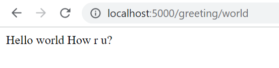

PS C:\Users\test\my-folder\Workspaces\my-docker-learn> docker images
REPOSITORY   TAG       IMAGE ID       CREATED       SIZE
nginx        latest    670dcc86b69d   2 days ago    142MB
alpine       latest    d7d3d98c851f   3 days ago    5.53MB
test1        latest    41366efd695a   3 days ago    5.53MB
mysql        latest    33037edcac9b   9 days ago    444MB
openjdk      latest    38c164acc56b   2 weeks ago   464MB
ubuntu       latest    27941809078c   6 weeks ago   77.8MB

PS C:\Users\test\my-folder\Workspaces\my-docker-learn> docker run --rm -it test1
/ # ls
bin    dev    etc    home   lib    media  mnt    opt    proc   root   run    sbin   srv    sys    tmp    usr    var
/ # pwd
/
/ # vi
/bin/sh: :q: not found
=> [internal] load metadata for docker.io/library/alpine:latest                                                                                   0.0s
=> CACHED [1/2] FROM docker.io/library/alpine                                                                                                     0.0s
=> [2/2] RUN touch hello.txt                                                                                                                      0.4s
=> exporting to image                                                                                                                             0.0s
=> => exporting layers                                                                                                                            0.0s
=> => writing image sha256:d8bf7a1108c060ee1a5f7274f776becee3e3f745bba943daed0076fdf78e9116                                                       0.0s
=> => naming to docker.io/library/test1                                                                                                           0.0s

Use 'docker scan' to run Snyk tests against images to find vulnerabilities and learn how to fix them
PS C:\Users\test\my-folder\Workspaces\my-docker-learn> docker build -t test1 .
[+] Building 0.1s (6/6) FINISHED
=> [internal] load build definition from Dockerfile                                                                                               0.0s
=> => transferring dockerfile: 31B                                                                                                                0.0s
=> [internal] load .dockerignore                                                                                                                  0.0s
=> => transferring context: 2B                                                                                                                    0.0s
=> [internal] load metadata for docker.io/library/alpine:latest                                                                                   0.0s
=> [1/2] FROM docker.io/library/alpine                                                                                                            0.0s
=> CACHED [2/2] RUN touch hello.txt                                                                                                               0.0s
Use 'docker scan' to run Snyk tests against images to find vulnerabilities and learn how to fix them
PS C:\Users\test\my-folder\Workspaces\my-docker-learn> docker build -t test1 .
[+] Building 0.1s (6/6) FINISHED
=> [internal] load build definition from Dockerfile                                                                                               0.0s
=> => transferring dockerfile: 31B                                                                                                                0.0s
=> [internal] load .dockerignore                                                                                                                  0.0s
=> => transferring context: 2B                                                                                                                    0.0s
=> [internal] load metadata for docker.io/library/alpine:latest                                                                                   0.0s
=> [1/2] FROM docker.io/library/alpine                                                                                                            0.0s
=> CACHED [2/2] RUN touch hello.txt                                                                                                               0.0s
=> => exporting layers                                                                                                                            0.0s
=> => writing image sha256:d8bf7a1108c060ee1a5f7274f776becee3e3f745bba943daed0076fdf78e9116                                                       0.0s
=> => naming to docker.io/library/test1                                                                                                           0.0s

Use 'docker scan' to run Snyk tests against images to find vulnerabilities and learn how to fix them
/ # ls
bin        etc        home       media      opt        root       sbin       sys        usr
dev        hello.txt  lib        mnt        proc       run        srv        tmp        var
/ # vi hello.txt
/ # exit
PS C:\Users\test\my-folder\Workspaces\my-docker-learn> docker build -t test1 .     
[+] Building 0.6s (7/7) FINISHED
=> [internal] load build definition from Dockerfile                                                                                               0.0s
=> => transferring dockerfile: 173B                                                                                                               0.0s
=> [internal] load .dockerignore                                                                                                                  0.0s
=> => transferring context: 2B                                                                                                                    0.0s
=> [internal] load metadata for docker.io/library/alpine:latest                                                                                   0.0s
=> [1/3] FROM docker.io/library/alpine                                                                                                            0.0s
=> CACHED [2/3] RUN touch hello.txt                                                                                                               0.0s
=> [3/3] RUN mkdir code:     cd code;     echo "Hello World Docker" > hello-world.txt WORKDIR code                                                0.4s
=> => exporting layers                                                                                                                            0.0s
=> => writing image sha256:3dc43fc46238547ecb1d8b6af6f5aeb3116dad5f3512d54c41a09df69dec4d38                                                       0.0s

Use 'docker scan' to run Snyk tests against images to find vulnerabilities and learn how to fix them
PS C:\Users\test\my-folder\Workspaces\my-docker-learn> docker run --rm -it test1 bash
docker: Error response from daemon: failed to create shim task: OCI runtime create failed: runc create failed: unable to start container process: exec:
"bash": executable file not found in $PATH: unknown.
PS C:\Users\test\my-folder\Workspaces\my-docker-learn> docker run --rm -it test1 sh  
/ # ls
bin              code:            hello-world.txt  lib              opt              run              sys              var
cd               dev              hello.txt        media            proc             sbin             tmp
code             etc              home             mnt              root             srv              usr
/ # cd code
/code # ls
/code # cat hello-world.txt
cat: can't open 'hello-world.txt': No such file or directory
/code # ls
/code # pwd
/code
/code # ls
/code # cd ..
/ # ls
cd               dev              hello.txt        media            proc             sbin             tmp
code             etc              home             mnt              root             srv              usr
/ # cat hello-world.txt
Hello World Docker WORKDIR code
/ # exit
PS C:\Users\test\my-folder\Workspaces\my-docker-learn> docker build -t test1 .       
[+] Building 0.7s (8/8) FINISHED
=> [internal] load build definition from Dockerfile                                                                                               0.0s
=> => transferring dockerfile: 171B                                                                                                               0.0s
=> [internal] load .dockerignore                                                                                                                  0.0s
=> => transferring context: 2B                                                                                                                    0.0s
=> [internal] load metadata for docker.io/library/alpine:latest                                                                                   0.0s
=> [1/4] FROM docker.io/library/alpine                                                                                                            0.0s
=> CACHED [2/4] RUN touch hello.txt                                                                                                               0.0s
=> [3/4] RUN mkdir code:     cd code;     echo "Hello World Docker" > hello-world.txt                                                             0.5s
=> [4/4] WORKDIR code                                                                                                                             0.0s
=> => exporting layers                                                                                                                            0.0s
=> => writing image sha256:be9f0e30527557e8e26f188a82e9bd97bdbcd550cffd6c64ec1dc034b9e1f34d                                                       0.0s
=> => naming to docker.io/library/test1                                                                                                           0.0s

Use 'docker scan' to run Snyk tests against images to find vulnerabilities and learn how to fix them
PS C:\Users\test\my-folder\Workspaces\my-docker-learn> docker run --rm -it test1
/code # ls
/code # pwd
/code
/code # cd ..
/ # ls
cd               dev              hello.txt        media            proc             sbin             tmp
code             etc              home             mnt              root             srv              usr
/ # cat hello-world.txt
Hello World Docker
/ # exit
PS C:\Users\test\my-folder\Workspaces\my-docker-learn> docker build -t test1 .                                                                          
[+] Building 0.1s (8/8) FINISHED
=> [internal] load build definition from Dockerfile                                                                                               0.0s
=> => transferring dockerfile: 32B                                                                                                                0.0s
=> [internal] load .dockerignore                                                                                                                  0.0s
=> => transferring context: 2B                                                                                                                    0.0s
=> [internal] load metadata for docker.io/library/alpine:latest                                                                                   0.0s
=> [1/4] FROM docker.io/library/alpine                                                                                                            0.0s
=> CACHED [2/4] RUN touch hello.txt                                                                                                               0.0s
=> CACHED [3/4] RUN mkdir code:     cd code;     echo "Hello World Docker" > hello-world.txt                                                      0.0s
=> CACHED [4/4] WORKDIR code                                                                                                                      0.0s
=> => exporting layers                                                                                                                            0.0s
=> => writing image sha256:be9f0e30527557e8e26f188a82e9bd97bdbcd550cffd6c64ec1dc034b9e1f34d                                                       0.0s

Use 'docker scan' to run Snyk tests against images to find vulnerabilities and learn how to fix them
PS C:\Users\test\my-folder\Workspaces\my-docker-learn> docker run --rm -it test1
/code # ls
/code # exit
PS C:\Users\test\my-folder\Workspaces\my-docker-learn> docker build -t test1 .  
[+] Building 0.1s (8/8) FINISHED
=> [internal] load build definition from Dockerfile                                                                                               0.0s
=> => transferring dockerfile: 169B                                                                                                               0.0s
=> [internal] load .dockerignore                                                                                                                  0.0s
=> => writing image sha256:be9f0e30527557e8e26f188a82e9bd97bdbcd550cffd6c64ec1dc034b9e1f34d                                                       0.0s
=> => naming to docker.io/library/test1                                                                                                           0.0s

Use 'docker scan' to run Snyk tests against images to find vulnerabilities and learn how to fix them
PS C:\Users\test\my-folder\Workspaces\my-docker-learn> docker run --rm -it test1
/code # ls
/code # exit
PS C:\Users\test\my-folder\Workspaces\my-docker-learn> docker build -t test1 .  
[+] Building 0.1s (8/8) FINISHED
=> [internal] load build definition from Dockerfile                                                                                               0.0s
=> => transferring dockerfile: 211B                                                                                                               0.0s
=> => transferring context: 2B                                                                                                                    0.0s
=> [internal] load metadata for docker.io/library/alpine:latest                                                                                   0.0s
=> CACHED [2/4] RUN touch hello.txt                                                                                                               0.0s
=> CACHED [3/4] RUN mkdir code:     cd code;     echo "Hello World Docker" > hello-world.txt                                                      0.0s
=> CACHED [4/4] WORKDIR code                                                                                                                      0.0s
=> exporting to image                                                                                                                             0.0s
=> => exporting layers                                                                                                                            0.0s
=> => writing image sha256:6eb501b1cbdd4a669eeec43acdd914ddb2f28e41df4275d7cf1a9dcfcfc94e74                                                       0.0s
=> => naming to docker.io/library/test1                                                                                                           0.0s

Use 'docker scan' to run Snyk tests against images to find vulnerabilities and learn how to fix them
PS C:\Users\test\my-folder\Workspaces\my-docker-learn> docker run --rm -it test1
Welcome to my container
/code # exit
PS C:\Users\test\my-folder\Workspaces\my-docker-learn> docker build -t test1 .  
[+] Building 1.5s (8/8) FINISHED
=> [internal] load build definition from Dockerfile                                                                                               0.0s
=> => transferring dockerfile: 287B                                                                                                               0.0s
=> [internal] load .dockerignore                                                                                                                  0.0s
=> [internal] load metadata for docker.io/library/openjdk:latest                                                                                  0.0s
=> [internal] load build context                                                                                                                  0.1s
=> => transferring context: 173B                                                                                                                  0.0s
=> [1/3] FROM docker.io/library/openjdk                                                                                                           0.1s
=> [2/3] COPY Hello.java .                                                                                                                        0.0s
=> exporting to image                                                                                                                             0.0s
=> => exporting layers                                                                                                                            0.0s
=> => writing image sha256:38651b0746047d7fb44e70e5f5cc918abfff193ee5a2803480a2e242e34a34fb                                                       0.0s
=> => naming to docker.io/library/test1                                                                                                           0.0s

Use 'docker scan' to run Snyk tests against images to find vulnerabilities and learn how to fix them
sh-4.4# ^C
sh-4.4# :q
sh: :q: command not found
sh-4.4# exit
exit
PS C:\Users\test\my-folder\Workspaces\my-docker-learn> docker run --rm -it test1
sh-4.4# pwd
/
sh-4.4# ls
Hello.class  Hello.java  bin  boot  dev  etc  home  lib  lib64  media  mnt  opt  proc  root  run  sbin  srv  sys  tmp  usr  var
sh-4.4# exit
exit
PS C:\Users\test\my-folder\Workspaces\my-docker-learn> docker build -t test1 .  
[+] Building 0.1s (8/8) FINISHED
=> [internal] load build definition from Dockerfile                                                                                               0.0s
=> => transferring dockerfile: 301B                                                                                                               0.0s
=> [internal] load .dockerignore                                                                                                                  0.0s
=> [internal] load metadata for docker.io/library/openjdk:latest                                                                                  0.0s
=> [internal] load build context                                                                                                                  0.0s
=> => transferring context: 32B                                                                                                                   0.0s
=> [1/3] FROM docker.io/library/openjdk                                                                                                           0.0s
=> CACHED [2/3] COPY Hello.java .                                                                                                                 0.0s
=> CACHED [3/3] RUN javac Hello.java                                                                                                              0.0s
=> exporting to image                                                                                                                             0.0s
=> => exporting layers                                                                                                                            0.0s
=> => writing image sha256:6d2438d0ea94f16bb83709728047cd7800e1a345c69b935ff8301ebac2957263                                                       0.0s
=> => naming to docker.io/library/test1                                                                                                           0.0s

Use 'docker scan' to run Snyk tests against images to find vulnerabilities and learn how to fix them
PS C:\Users\test\my-folder\Workspaces\my-docker-learn> docker run --rm -it test1
Hello World for Java.
sh-4.4# 

# PS C:\Users\test\my-folder\Workspaces\my-docker-learn> docker run --rm -p 5000:9000  my-docker-learn-image

=========|_|==============|___/=/_/_/_/
:: Spring Boot ::                (v2.7.1)

2022-07-26 15:53:32.288  INFO 1 --- [           main] c.m.d.l.m.MyDockerLearnApplication       : Starting MyDockerLearnApplication v0.0.1-SNAPSHOT using
Java 18.0.1.1 on 6563972ab161 with PID 1 (/app.jar started by root in /)
2022-07-26 15:53:32.291  INFO 1 --- [           main] c.m.d.l.m.MyDockerLearnApplication       : No active profile set, falling back to 1 default profil
e: "default"
2022-07-26 15:53:33.798  INFO 1 --- [           main] o.s.b.web.embedded.netty.NettyWebServer  : Netty started on port 9000
2022-07-26 15:53:33.812  INFO 1 --- [           main] c.m.d.l.m.MyDockerLearnApplication       : Started MyDockerLearnApplication in 1.98 seconds (JVM r
unning for 2.455)

