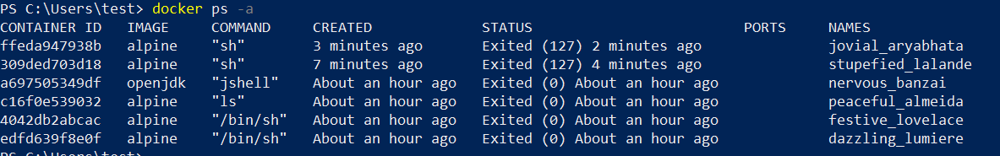
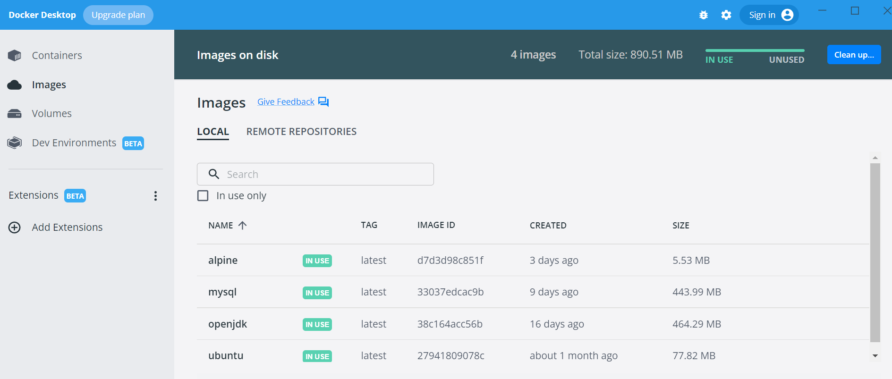
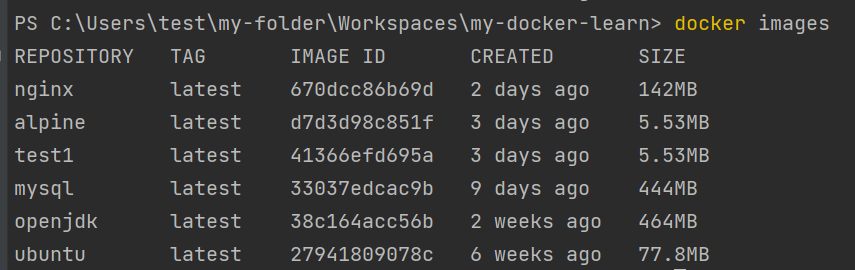
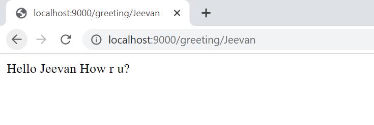
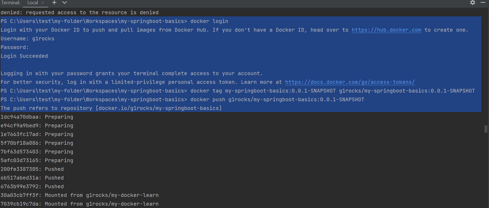

# Learning Docker
default docker repo => https://hub.docker.com/

Image: Static (set of bytes)
Container: Running version.

Docker CLI => communicates with Docker Demon (Docker Engine) using gRPC protocol. 

# Docker commands:
<code>docker pull ubuntu</code>  => client makes a gRPC to Docker Demon (DockerEngine) 
& it translates it into a container inside the VM (WSL-2.0 in Windows).  

<code>docker ps -a</code>  ---> list all docker containers

<code>docker run ubuntu</code>

<code>docker run ubuntu ls</code>  ---> list all contents (folders/files) of the current container

---> getting into an interactive shell using "-it"

<code>docker run -it alpine sh</code> ---> i(interactive) t(terminal)

<code>docker start <container-id>/<container-name></code> ---> restart a stopped container.

<code>docker stop <container-id>/<container-name></code>

<code>docker kill <container-id>/<container-name></code>

<code>docker rm <container-id>/<container-name></code> ---> remove (frees up disk space allocated to the stopped container).

<code>docker run --name my-java-container -it openjdk bash</code>  ---> naming a container (my-java-container)

<code>docker commit</code> ---> create a new image from container.

---> running a command on an existing running docker container.

<code>docker exec <container-id>/<container-name> <command></code> 

<code>docker exec my-java-container ls</code>

<code>docker run --name my-mysql -e MYSQL_ROOT_PASSWORD=secret -d mysql</code> ---> -d(detach) -e(env variable)

---> accessing certain files/folders from the host OS inside the container by giving the container access to them.
<code>docker run --rm -it -v ${PWD}:/hostvol ubuntu bash</code> --> -v(specifies the volume) 

---> create volume
<code>docker volume create <volume-name></code>

---> mapping ports in docker (-p {HostPort}:{ContainerPort})
<code>docker run -p 8080:80 nginx</code>

docker images

# Creating docker image using Dockerfile:
<code>docker build -t <image-name> .</code>

<code>docker build -t my-spring-cloud-learning .</code>

# Run docker image:
<code>docker run -p 5000:5000 g1rocks/my-spring-cloud-learning:0.0.1-SNAPSHOT</code>

PS C:\Users\test\my-folder\Workspaces\my-docker-learn> docker build -t my-docker-learn-img-1 .
    [+] Building 0.6s (7/7) FINISHED
    => [internal] load build definition from Dockerfile                                                                                               0.0s
    => => transferring dockerfile: 31B                                                                                                                0.0s
    => => transferring context: 2B                                                                                                                    0.0s
    => [internal] load metadata for docker.io/library/openjdk:11                                                                                      0.4s
    => [internal] load build context                                                                                                                  0.0s
    => => transferring context: 91B                                                                                                                   0.0s
    => [1/2] FROM docker.io/library/openjdk:11@sha256:99bac5bf83633e3c7399aed725c8415e7b569b54e03e4599e580fc9cdb7c21ab                                0.0s
    => CACHED [2/2] COPY target/*.jar app.jar                                                                                                         0.0s
    => exporting to image                                                                                                                             0.0s
    => => exporting layers                                                                                                                            0.0s
    => => writing image sha256:a03acab75905030b036d33814ad96d6b938876806a8336df37370e5876867d69                                                       0.0s
    => => naming to docker.io/library/my-docker-learn-img-1                                                                                           0.0s

Use 'docker scan' to run Snyk tests against images to find vulnerabilities and learn how to fix them

PS C:\Users\test\my-folder\Workspaces\my-docker-learn> docker run -p 9000:9000 -it my-docker-learn-img-1
    .   ____          _            __ _ _
    /\\ / ___'_ __ _ _(_)_ __  __ _ \ \ \ \
    ( ( )\___ | '_ | '_| | '_ \/ _` | \ \ \ \
    \\/  ___)| |_)| | | | | || (_| |  ) ) ) )
    '  |____| .__|_| |_|_| |_\__, | / / / /
    =========|_|==============|___/=/_/_/_/
    :: Spring Boot ::                (v2.7.1)
    
    2023-02-03 03:54:50.055  INFO 1 --- [           main] c.m.d.l.m.MyDockerLearnApplication       : Starting MyDockerLearnApplication v0.0.1-SNAPSHOT using
    Java 11.0.16 on 493329a82103 with PID 1 (/app.jar started by root in /)
    2023-02-03 03:54:50.060  INFO 1 --- [           main] c.m.d.l.m.MyDockerLearnApplication       : No active profile set, falling back to 1 default profil
    e: "default"
    2023-02-03 03:54:51.643  INFO 1 --- [           main] o.s.b.web.embedded.netty.NettyWebServer  : Netty started on port 9000
    2023-02-03 03:54:51.661  INFO 1 --- [           main] c.m.d.l.m.MyDockerLearnApplication       : Started MyDockerLearnApplication in 2.101 seconds (JVM
    running for 2.588)

PS C:\Users\test\my-folder\Workspaces\my-springboot-basics> mvn spring-boot:build-image
PS C:\Users\test\my-folder\Workspaces\my-springboot-basics> docker login
Login with your Docker ID to push and pull images from Docker Hub. If you don't have a Docker ID, head over to https://hub.docker.com to create one.
Username: g1rocks
Password:
Login Succeeded

