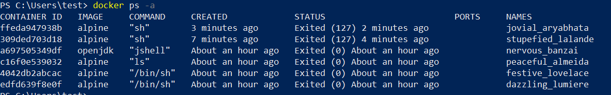

# Learning Docker
default docker repo => https://hub.docker.com/

Docker CLI => communicates with Docker Deamon

# Docker commands:
docker pull ubuntu

docker ps -a  ---> list all docker containers

docker run ubuntu

docker run ubuntu ls  ---> list all contents (folders/files) of the current container

---> getting into an interactive shell using "-it"
docker run -it alpine sh ---> i(interactive) t(terminal)

